# Architecture

## Training Path

```mermaid
flowchart LR
    A["Synthetic, CSV, or Yahoo data"] --> B["Strict OHLCV validation"]
    B --> C["36 trailing features"]
    C --> D["Chronological development / holdout split"]
    D --> E["Time-series parameter search"]
    E --> F["Out-of-fold probability calibration"]
    F --> G["Learned threshold and uncertainty band"]
    G --> H["Final holdout evaluation"]
    H --> I["JSON + NPZ model artifact"]
```



The holdout is the newest 20% of the dataset and is not used for parameter search, calibration, or
threshold selection. Cross-validation uses expanding windows with a gap equal to the forecast
horizon.

## Feature Groups

- Returns and acceleration over 1, 2, 5, 10, and 20 sessions
- Moving-average distance, Bollinger position, and normalized trend slopes
- Total and downside volatility, skew, and short autocorrelation
- RSI, MACD histogram, ATR, and stochastic position
- Overnight gap, candle body, range, close location, and wick lengths
- Volume change, volume regime, volume trend, price-volume correlation, and Chaikin money flow

All features use information available at or before the prediction timestamp.

## Model

The primary estimator is Extra Trees. It handles nonlinear interactions without requiring feature
scaling and provides fast batch fitting on CPU. A logistic model remains as the reference baseline.

Raw tree probabilities are calibrated using logistic calibration fitted only on temporal
out-of-fold predictions. The classification threshold is selected on those same out-of-fold
predictions using balanced accuracy. An uncertainty margin is stored with the model.

## Artifact Format

The API does not deserialize Python objects.

```text
model/
├── manifest.json
└── forest.npz
```

The manifest stores feature names, median imputation values, calibration parameters, the learned
threshold, uncertainty margin, horizon, run metadata, and a SHA-256 digest of the archive.

The NPZ contains primitive numeric arrays for tree offsets, child indices, split features,
thresholds, and positive-class leaf probabilities. The custom predictor traverses those arrays
directly.

## Security Boundaries

- No generated Python or subprocess execution
- No pickle-compatible model loading
- Model checksum and structural validation
- Regular-file and symlink checks
- Compressed and uncompressed artifact limits
- Request size and candle-count limits
- Optional constant-time API-key verification
- Trusted-host middleware
- API error responses do not expose model paths or load exceptions
- Docker process runs without root privileges

An upstream reverse proxy should still provide TLS, rate limiting, access logs, and a hard request
body limit for internet-facing deployments.

## Artifact Publication

Runs are immutable. Training writes a complete run directory first, builds a staging copy of the
latest outputs, and only then replaces `artifacts/latest`. A failed run cannot leave a partially
written current model.
